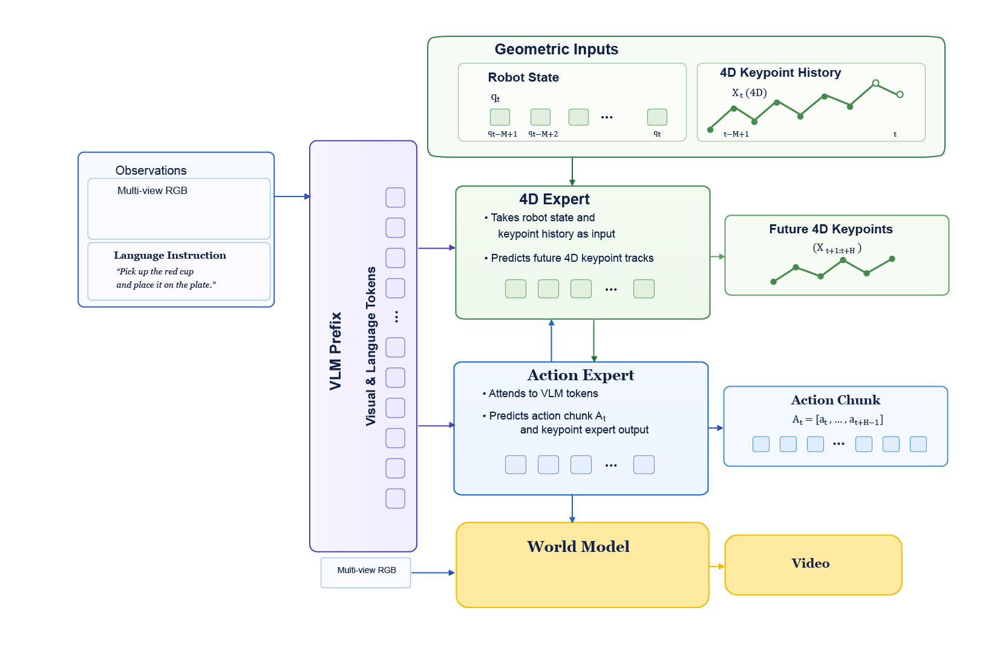
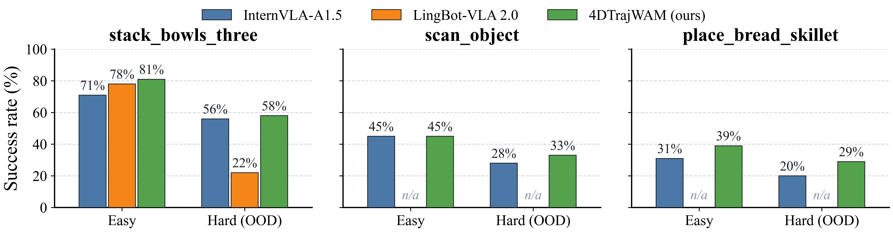

# 4DW-VLA: 4D Trajectory-Conditioned Mixture-of-Transformers for Multimodal Robotic Manipulation

**Gang Luo**  
Daohe Tongtai

---

## Abstract

Foundation vision-language-action (VLA) models have made rapid progress on robotic manipulation, yet they still under-use the sensors a robot actually has: most policies consume 2D images, inject little metric spatial structure, and treat heterogeneous modalities as a single undifferentiated token stream. We argue that effective manipulation policies should (i) reason about the robot's own 3D pose over time and (ii) learn future dynamics as an action-facing training signal, without paying video-generation cost at deployment. We introduce **4DW-VLA**, a three-path mixture-of-transformers policy that co-trains three complementary objectives on a frozen vision-language backbone: future 4D keypoint trajectories obtained from forward kinematics, future-video prediction conditioned on those tracks, and chunked action generation. At inference the keypoint expert is retained and continues to condition the action expert; only the video generator is dropped, so the policy pays no video-generation cost. On three RoboTwin 2.0 tasks after a common 76-epoch post-training schedule, 4DW-VLA matches or exceeds two recent VLA baselines, InternVLA-A1.5 and LingBot-VLA 2.0, across all evaluated splits, with the largest advantage under domain randomization — consistent with the claim that embodiment-centric 4D supervision supplies spatial structure that image-only VLAs lack.

---

## 1. Introduction

Learning-based policies have shown great effectiveness in robotic manipulation [rt1, rt2, chi2023diffusion, zhao2023act, kim2024openvla, black2024pi0]. Scaling vision-language models (VLMs) into vision-language-action (VLA) policies [rt2, kim2024openvla, black2024pi0, liu2024rdt, internvla15] has further improved instruction following and few-shot adaptation. However, these policies often remain brittle under novel scenes, objects, and distractors [xie2024decomposing], and they typically consume only RGB images even though a robot is a multi-sensor system operating in a metric 3D workspace.

We identify three recurring gaps. First, and most fundamentally, **privileged, non-visual signals are fused into VLA backbones through a single, undifferentiated attention pattern**. Whether the extra signal is a manipulator's own joint geometry, a distilled future-dynamics code, or a sub-task plan, most architectures give it no dedicated capacity: it is either concatenated into the same token stream as everything else, or bolted on as a residual branch with its own encoder and decoder. Neither treats the signal as a first-class citizen of the backbone's own attention computation, and neither is retained past training when the signal is genuinely useful at deployment. Second, **spatial information is under-used**. A manipulator's own joints already determine metric end-effector and link poses through forward kinematics (FK); this signal is free, temporally dense, and aligned with the action, yet it is rarely treated as a first-class prediction target, and when it is, it is usually injected through exactly the kind of undifferentiated fusion described above. Third, **heterogeneous modalities are fused as if they were homogeneous**. Images arrive at approximately 25 Hz, proprioception and force at much higher rates, and language at a single prompt; early, late, and full fusion, as well as *who attends to whom*, should differ across heads [octo, oneill2024oxe].

A complementary limitation of reactive VLAs is the absence of explicit future reasoning. World models and world-action models (WAMs) address this by predicting how the scene will evolve [ha2018worldmodels, levy2026simdist, nvidia2026wam, lawam2026], but pixel-level generation is expensive at control time. Recent work therefore uses future prediction as **training-time regularization** and discards it at inference [internvla15, nvidia2026wam, dreaming2026]. We adopt that pattern, but treat future-dynamics foresight itself as one more privileged signal that must be fused through the same dedicated-expert mechanism, not as a separate concern.

**Our starting point** is that a privileged, non-visual signal deserves its own first-class attention path, not a token concatenated into an undifferentiated stream or a residual branch bolted onto the backbone. We instantiate this with embodiment-centric 4D keypoint trajectories, $p^k_t = \mathrm{FK}_k(q_t) \in \mathbb{R}^3$, the Cartesian position of keypoint $k$ (joints and end-effectors) in the robot base frame — a signal that is free, dense, and requires no external tracker or scene reconstruction — by giving it a dedicated **4D keypoint expert** that attends to the frozen VLM prefix and to history 4D tracks, alongside the action expert that attends to everything. This extends InternVLA-A1.5's two-path prefix/action-expert design into a **three-path mixture-of-transformers**. Unlike prior FK-based approaches that inject the signal through a residual decoder discarded at inference, the 4D keypoint expert is a genuine attention path, and we keep it active at deployment rather than discarding it with the rest of the auxiliary machinery: it continues to condition the action expert on metric 4D structure after training, not only during it. We route a distilled visual-foresight objective through the same three-path mechanism as a second auxiliary head; unlike the keypoint expert, the video generator itself is dropped at test time, so this objective improves the action expert during training without adding deployment cost.

We instantiate this idea as **4DW-VLA**[^1] (Fig. 1): a frozen VLM prefix, a 4D keypoint expert that fuses history 4D tracks and is retained at deployment, an action expert that additionally consumes distilled visual-foresight tokens, co-trained and then deployed with the keypoint expert active and only the video generator dropped. We post-train on RoboTwin 2.0 [chen2025robotwin2] against InternVLA-A1.5 [internvla15] and LingBot-VLA 2.0 [lingbot2026], and are additionally running a small-scale real-robot validation of the deployed policy (Section 4.4) to test sim-to-real transfer of the FK-derived 4D signal.

[^1]: The name reflects that the policy is a world-action model (Section 2) whose future-prediction signal is anchored by embodiment-centric trajectory prediction — the dedicated 4D keypoint expert that is this paper's central architectural contribution — rather than by video generation alone; the video-foresight flow-matching objective (Section 3) is carried over unchanged from InternVLA-A1.5. The name also distinguishes this architecture from the unrelated concurrent work 4D-WAM [fourdwam2026], which aligns dense scene trajectory fields inside a world-action model and shares no relationship with the keypoint-expert design studied here.

We summarize our contributions as follows:

1. We extend InternVLA-A1.5's two-path prefix/action-expert design into a **three-path mixture-of-transformers** by giving the privileged 4D keypoint signal a dedicated **4D keypoint expert** with its own attention path and its own future-trajectory prediction target — rather than injecting it as prefix tokens, in the style of GeoPredict's track encoder, or fusing it through a fixed-direction residual decoder discarded at inference, in the style of ELAN4D. The keypoint expert is **retained at deployment** and continues to condition the action expert on metric 4D structure, rather than being dropped with the rest of the auxiliary machinery. On three RoboTwin 2.0 tasks under a common post-training schedule, adding this expert to the InternVLA-A1.5 backbone improves success under a matched training budget (Section 4).

2. We instantiate the full model as **4DW-VLA**, additionally routing a distilled visual-foresight head through the same three-path mechanism as a second auxiliary signal, with a staged recipe (400-step warmup of the auxiliary experts with the VLM frozen, followed by joint post-training) that discards only the video-generation branch at inference: the keypoint expert continues to condition the action expert at deployment, and only the frozen video generator is dropped. On three RoboTwin 2.0 tasks under a common post-training schedule, 4DW-VLA matches or exceeds the reported InternVLA-A1.5 and LingBot-VLA 2.0 baselines, and a small-scale real-robot validation of the deployed policy (Section 4.4) is in progress.

---

## 2. Related Work

### 2.1 Foundation Models in Robotics

Policy foundation models — also called generalist robot policies — are trained on large, multi-task robot datasets [walke2023bridge, khazatsky2024droid, vuong2023oxe] and increasingly inherit internet-scale vision-language priors [rt2, kim2024openvla, black2024pi0, liu2024rdt]. Autoregressive VLAs such as RT-2 [rt2] and OpenVLA [kim2024openvla] discretize actions as tokens. Diffusion and flow-matching policies, including Diffusion Policy [chi2023diffusion], RDT [liu2024rdt], and $\pi_0$ / $\pi_{0.5}$ [black2024pi0], generate continuous action chunks. InternVLA-A1.5 [internvla15] attaches a lightweight unified expert to a native VLM, keeps VQA and sub-task prediction, and uses learnable foresight tokens supervised by a frozen video generator that is discarded at inference. LingBot-VLA 2.0 [lingbot2026] scales a sparse MoE VLA on approximately 60k hours of robot and egocentric data with a unified cross-embodiment action space and predictive-dynamics distillation.

4DW-VLA extends InternVLA-A1.5's two-path design — a frozen VLM prefix and an action expert that consumes learnable foresight tokens — with a third, dedicated **4D keypoint expert** for FK-derived 4D tracks that remains active at deployment (Section 4 isolates the effect of adding this expert against the InternVLA-A1.5 backbone). Unlike LingBot-VLA 2.0, we do not claim a new pretraining corpus; we study a post-training fusion mechanism and recipe on a public bimanual benchmark.

### 2.2 3D and 4D Representations for Manipulation

3D observations — RGB-D, point clouds, voxels, and 3D Gaussians — improve sample efficiency and spatial generalization relative to RGB-only policies [ze2024dp3, shridhar2022peract, yang2025fp3, gervet2023act3d]. DP3 [ze2024dp3] and FP3 [yang2025fp3] show that point clouds are a particularly effective 3D substrate for diffusion policies and for 3D foundation policies, respectively. GeoPredict [geopredict2026] encodes a variable-length history of 3D point tracks into a small set of learned tokens through a patchify-then-cross-attend track encoder, for geometric track prediction in vision-language-action models; our keypoint expert's track encoder builds directly on this design, adapted to consume FK-derived keypoints rather than externally tracked scene points. A parallel line injects **4D** (3D + time) supervision without changing the test-time interface. ELAN4D [elan4d2026] predicts future robot keypoint displacements from FK through a plug-and-play decoder discarded at inference, connected to the backbone by a single, fixed-direction gradient edge. 4DW-VLA differs less in the supervision signal — both use FK-derived keypoints — than in the **fusion mechanism**: our 4D keypoint expert is a first-class attention path that jointly reconstructs the current frame and predicts the future trajectory through a shared output head, and it is retained at deployment to keep conditioning the action expert on 4D structure, rather than being an auxiliary decoder that is discarded once training ends. Pri4R [pri4r2026] supervises a VLM with privileged scene point tracks. MotionVLA [motionvla2026] stores trajectory-field tokens as queryable motion history. **4D-WAM** [fourdwam2026] aligns intermediate WAM features with 3D *trajectory fields* of scene pixels (motion and destination alignment). That work is complementary and targets a different signal: **4DW-VLA predicts embodiment-centric joint trajectories**, not dense scene trajectory fields, and couples them to a distilled visual-foresight head and an action expert.

### 2.3 World Models and World-Action Models

World models learn to predict future states for planning or representation learning [ha2018worldmodels, levy2026simdist, hansen2024tdmpc2]. Simulation Distillation [levy2026simdist] pretrains a planning-oriented latent world model in simulation and adapts only dynamics in the real world. World-action models go further: the predicted future is *action-facing* — it produces, scores, or trains the action path [nvidia2026wam, lawam2026, dreaming2026, wamsurvey2026]. Fast-WAM-style systems co-train video prediction with actions and drop generation at test time [nvidia2026wam, dreaming2026]. LaWAM [lawam2026] predicts latent visual subgoals instead of pixels. 4DW-VLA follows the representation-only WAM template, but the future that regularizes the policy is **two-fold**: metric 4D body motion *and* distilled visual foresight, fused through the same three-path multi-expert mechanism, with the 4D-motion path kept active at deployment rather than discarded alongside the video path.

---

## 3. Method

We introduce 4DW-VLA, a 4D trajectory-conditioned three-path mixture-of-transformers for language-conditioned bimanual manipulation. The architecture (Fig. 1) follows a two-stage post-training recipe: a short warmup of the predictive heads, then joint optimization with a frozen VLM. We first formalize the control problem, then describe 4D tracks, distilled visual-foresight, heterogeneous fusion, the training objective, and the inference path.

**Figure 1. 4DW-VLA architecture.** A frozen VLM prefix encodes multi-view RGB and the language instruction. A dedicated **4D keypoint expert** takes robot state $q_t$ and a history of FK-derived 4D keypoint tracks $X_t$ as input and predicts future 4D keypoint tracks $X_{t+1:t+H}$; the **action expert** attends to the VLM prefix and to the 4D keypoint expert's output to predict the action chunk $A_t$. A frozen video world model, conditioned on the same multi-view RGB, supervises the shared representation during training only. At deployment the world model is dropped, but the 4D keypoint expert is retained and continues to condition the action expert on metric 4D structure.

### 3.1 Problem Formulation

We consider language-conditioned visuomotor control as modeling

$$
p\bigl(A_t \mid o_t, \ell_t, q_t\bigr),
\tag{1}
$$

where $o_t$ denotes multi-view RGB observations (head and wrist cameras), $\ell_t$ is the language instruction, $q_t$ is proprioception, and $A_t = [a_t, a_{t+1}, \ldots, a_{t+H-1}]$ is an action chunk of horizon $H$. We train a conditional generative action expert (flow matching or diffusion) to approximate this distribution, while an auxiliary keypoint expert predicts 4D tracks and a set of learnable foresight tokens, carried inside the action expert's own suffix stream, are distilled against a frozen video foundation model over a compatible horizon $T$.

### 3.2 Embodiment-Centric 4D Keypoint Trajectories

Robots already expose the quantities needed for metric 4D supervision. For each keypoint $k \in \{1,\ldots,K\}$ on the kinematic chain (major arm joints and both end-effectors),

$$
p^k_t = \mathrm{FK}_k(q_t) \in \mathbb{R}^3
\tag{2}
$$

is the Cartesian position in the robot base frame. Stacking keypoints over a short history window yields a history tensor $P^{\mathrm{hist}}_t$, which the keypoint expert attends to together with the frozen VLM prefix (Section 3.4) to produce a per-timestep query representation. That representation is projected through a shared output head to obtain two predictions: the current-frame keypoints $\hat{p}^k_t$, used as a reconstruction target, and the future keypoints $\hat{p}^k_{t+1:t+H}$ over the action horizon $H$, obtained by adding a learned per-step future positional embedding to the same query before reprojection — so the future and current predictions share weights rather than coming from two separate sub-networks. Supervision combines a current-frame term and a future-trajectory term,

$$
\mathcal{L}_{\mathrm{kpt}} = \beta \Bigl(
    \operatorname{MSE}\bigl(\hat{p}_t, p_t\bigr)
    + \gamma\, \operatorname{MSE}\bigl(\hat{p}_{t+1:t+H}, p_{t+1:t+H}\bigr)
\Bigr),
\tag{3}
$$

where each $\operatorname{MSE}(\cdot,\cdot)$ averages squared error over the $K$ keypoints and their 3 coordinates (and, for the future term, over the horizon $H$ as well), $\beta$ is the overall keypoint-loss weight, and $\gamma$ weights the future term relative to the current-frame term. Ground-truth keypoints are computed from recorded $q_{t+\tau}$ via the same FK, so no external point tracker or scene reconstruction is required. This is the same privileged-body idea as ELAN4D [elan4d2026], lifted from an auxiliary residual branch into a **first-class input-and-output** of a WAM.

### 3.3 Distilled Visual Foresight from Observation, Instruction, and State

Rather than a separate head with its own encoder, foresight is carried by $M$ **learnable foresight tokens** $Z^{\mathrm{fs}}_t \in \mathbb{R}^{M \times d}$, appended to the action expert's own suffix stream alongside the action tokens. Because the action expert attends to the prefix, the keypoint expert, and its own suffix (Section 3.4), $Z^{\mathrm{fs}}_t$ is conditioned on the predicted future keypoints $\hat{p}_{t+1:t+H}$ through that shared attention path, without a dedicated video-to-4D cross-attention edge. Supervision is a genuine flow-matching objective against a **frozen** video diffusion transformer (DiT) $g_{\mathrm{wan}}$ (WAN2.2-TI2V-5B): the real future frames $o_{t+1:t+T}$ are encoded by the frozen WAN2.2 VAE into a latent $x_0$, corrupted along a linear path $x_\tau = (1-\tau) x_0 + \tau \epsilon$ with $\epsilon \sim \mathcal{N}(0, I)$ and $\tau \sim U[0,1]$, and $g_{\mathrm{wan}}$ is trained to predict the corresponding denoising velocity $\epsilon - x_0$, conditioned on $x_\tau$ and on the projected foresight tokens $h(Z^{\mathrm{fs}}_t)$ supplied as cross-attention context. This is structurally identical to the action expert's own flow-matching loss on action chunks, except that $g_{\mathrm{wan}}$'s weights are frozen throughout and only $h$ and the upstream foresight tokens are updated.[^2]

[^2]: This is a genuine generative-modeling objective evaluated at training time rather than a feature-distillation loss: the target is a real noised video latent, and $g_{\mathrm{wan}}$ performs the same one-step velocity prediction it performs during iterative sampling, so no frames are actually generated during training. This video/flow-matching mechanism is inherited unchanged from InternVLA-A1.5 [internvla15]; 4DW-VLA's contribution is routing the foresight tokens through the same keypoint-expert-aware attention paths as the action expert, not a new video objective.

### 3.4 Heterogeneous Multimodal Fusion

The design in Fig. 1 is motivated by the three pain points in Section 1, not by a single fusion block:

- **Modalities.** Images, video, text, 3D/4D geometry, and (in the broader framework) tactile and force streams. The current RoboTwin instantiation uses RGB, language, proprioception, and FK 4D; force / tactile remain architectural slots (Section 5).
- **Who attends to whom.** Text attends to images (VLM cross-attention). The keypoint expert attends to the prefix and to history 4D tracks. The action expert attends to **all** streams — prefix, keypoint expert, and its own suffix (which also carries the distilled foresight tokens) — because control must bind semantics, geometry, and dynamics. Fig. 2 shows the resulting block-causal attention mask directly.
- **Early / late / full fusion.** Proprioception and 4D tracks, being low-dimensional and metric, are fused late with VLM tokens; RGB and language are fused early inside the frozen VLM.
- **Rates.** Cameras are modeled at 25 Hz; force-control loops (when present) at 100 Hz. Rate-aware sampling avoids naively duplicating high-rate tokens in the VLM context.

**Figure 2. Block-causal attention mask.** Rows are query blocks, columns are key blocks; light cells are attended, dark cells are masked. The VLM prefix attends causally only to itself. The keypoint expert — proprioceptive state, history keypoints, and future-keypoint queries — attends to the prefix and to itself. The action expert — learnable foresight tokens and action queries — attends to the prefix, the keypoint expert, and itself, the only block with access to all three streams.

These choices are a *design language* for later sensors, not a claim that every slot is active in the experiments of Section 4.

### 3.5 Multi-Task Objective and Staged Warmup

Training minimizes a stationary multi-task loss

$$
\mathcal{L} = \lambda_{\mathrm{act}}\mathcal{L}_{\mathrm{act}}
    + \lambda_{\mathrm{vqa}}\mathcal{L}_{\mathrm{vqa}}
    + \lambda_{\mathrm{vid}}\mathcal{L}_{\mathrm{vid}}
    + \mathcal{L}_{\mathrm{kpt}}.
\tag{4}
$$

$\mathcal{L}_{\mathrm{act}}$ is the action-expert denoising / flow-matching loss on expert chunks, and $\mathcal{L}_{\mathrm{vqa}}$ is a next-token cross-entropy loss that keeps the underlying VLM's VQA and sub-task prediction capability (Section 2) intact during post-training. $\mathcal{L}_{\mathrm{kpt}}$ already carries its own internal weights $\beta$ and $\gamma$ (Eq. 3), so it enters the total loss without an additional coefficient. The remaining coefficients $\lambda_{\cdot}$ are fixed hyperparameters.

**Staged post-training.**

1. **Warmup (400 steps).** Update the keypoint expert and the foresight-distillation projection at the default rate; keep the VLM frozen; scale the action expert's learning rate down to $0.04\times$ the default rate. This lets the newly-initialized keypoint expert and foresight tokens learn quickly while limiting how much the already-pretrained action expert drifts during the short warmup.
2. **Joint post-training (76 epochs).** Continue with the VLM frozen. The three compared methods use the same 76-epoch post-training schedule.

### 3.6 Inference: Action Prediction Only

At deployment we simply evaluate the trained policy $\pi_\theta$ on the current observation, instruction, and proprioception to obtain the action chunk $A_t$. Unlike Fast-WAM / InternVLA-A1.5, where the entire auxiliary path is discarded at inference, the keypoint expert is **retained**: it continues to attend to the frozen VLM prefix and to history 4D tracks $P^{\mathrm{hist}}_t$ (computed from $q_t$ via FK, not from an external sensor), and the action expert continues to attend to it, so 4D conditioning persists into deployment. Only the video-generation branch is dropped — the learnable foresight tokens are still produced inside the action expert's own suffix, but the frozen video DiT $g_{\mathrm{wan}}$ that would consume them for generation is neither invoked nor loaded at deployment (Section 3), so no video-generation cost is paid. The deployed policy therefore keeps the keypoint expert's extra forward pass and its FK-derived input; only the future-video head matches the "train with foresight, drop at test time" pattern.

---

## 4. Experiments

We evaluate 4DW-VLA on RoboTwin 2.0 [chen2025robotwin2] and compare against recent foundation VLAs. We aim to answer:

1. Does co-training the 4D keypoint expert with distilled visual foresight improve in-domain (Easy) success over strong VLA baselines under a common 76-epoch post-training budget?
2. Does the same recipe improve robustness on the Hard (domain-randomized, OOD) split?
3. Does the trend persist across stacking, tool-use scanning, and placement tasks?

### 4.1 Experimental Setup

**Benchmark.** RoboTwin 2.0 is a dual-arm manipulation suite on SAPIEN with strong domain randomization along clutter, lighting, background texture, table height, and language [chen2025robotwin2]. We follow the public Easy / Hard protocol: Easy corresponds to `demo_clean`; Hard to `demo_randomized`. Evaluations use the Aloha-AgileX bimanual embodiment. Success rate is the metric.

**Tasks.**

- `stack_bowls_three`: stack three bowls. The task is geometrically precise and contact-rich.
- `scan_object`: one arm grasps a scanner, the other grasps an object, then the scanner is used on the object. This stresses dual-arm coordination and tool use.
- `place_bread_skillet`: place bread in a skillet. This provides an additional placement task for testing robustness across a different manipulation objective.

**Baselines.** InternVLA-A1.5 [internvla15] (Shanghai AI Laboratory) unifies understanding, latent foresight, and action; LingBot-VLA 2.0 [lingbot2026] (Robbyant / Ant Group) is a 6B cross-embodiment VLA with predictive-dynamics distillation. InternVLA-A1.5 and 4DW-VLA are both trained and evaluated in our own codebase under a common **76-epoch** post-training schedule; 4DW-VLA additionally uses the 400-step keypoint-and-foresight warmup, a frozen VLM, and a $0.04\times$ action-expert learning-rate scale during warmup (Table 2). **LingBot-VLA 2.0 is not reproduced by us**: we do not have its checkpoint, training code, or configuration, so its numbers are taken as-reported from its own release and are not independently verified to have used a matching schedule. The schedule-matching claim above therefore applies only to InternVLA-A1.5 and 4DW-VLA; LingBot-VLA 2.0 should be read as an external reference point, not a controlled comparison. LingBot-VLA 2.0 was not evaluated on `scan_object` or `place_bread_skillet` (denoted n/a).

**Table 1. Post-training success rates (%) on RoboTwin 2.0.** Easy = `demo_clean`; Hard = `demo_randomized` (OOD). Bold is best in each column. LingBot-VLA 2.0 was not evaluated on `scan_object` or `place_bread_skillet`.

| Method | stack_bowls_three Easy | stack_bowls_three Hard | scan_object Easy | scan_object Hard | place_bread_skillet Easy | place_bread_skillet Hard |
|--------|------------------------|------------------------|------------------|------------------|--------------------------|--------------------------|
| InternVLA-A1.5 | 71 | 56 | **45** | 28 | 31 | 20 |
| LingBot-VLA 2.0 | 78 | 22 | n/a | n/a | n/a | n/a |
| **4DW-VLA (ours)** | **81** | **58** | **45** | **33** | **39** | **29** |

**Table 2. 4DW-VLA post-training recipe.**

| Item | Setting |
|------|---------|
| Benchmark | RoboTwin 2.0 |
| Post-training budget | 76 epochs (all methods) |
| Warmup | 400 steps on keypoint + foresight heads |
| VLM | Frozen |
| Warmup LR scale (action) | $0.04\times$ default |
| Easy / Hard | `demo_clean` / `demo_randomized` |

### 4.2 Main Results

Fig. 3 visualizes Table 1.

**Figure 3. RoboTwin 2.0 success rates.** Grouped bars for Easy and Hard (OOD) on three tasks. LingBot-VLA 2.0 is not evaluated on `scan_object` or `place_bread_skillet` (n/a). All three methods use the reported 76-epoch post-training schedule.

**`stack_bowls_three`.** 4DW-VLA attains 81% Easy and 58% Hard, exceeding InternVLA-A1.5 (71% / 56%) and LingBot-VLA 2.0 (78% / 22%). The Easy ranking is tight (81 vs. 78 vs. 71), as expected when all methods are evaluated after the same reported schedule. The Hard split is not: LingBot-VLA 2.0 drops to 22%, while 4DW-VLA remains slightly above InternVLA-A1.5 (58% vs. 56%). We interpret this result as consistent with the hypothesis that metric FK tracks complement visual dynamics priors in randomized scenes, rather than as proof of a single-module causal effect.

**`scan_object`.** InternVLA-A1.5 and 4DW-VLA both reach 45% Easy. On Hard, 4DW-VLA reaches 33% versus 28%. The improvement is modest but suggests that the 4D body trajectory gives the action expert a more stable geometric reference for dual-arm tool use when visual context is randomized.

**`place_bread_skillet`.** 4DW-VLA reaches 39% Easy and 29% Hard, compared with 31% and 20% for InternVLA-A1.5. The absolute gains are 8 and 9 percentage points, respectively. Since LingBot-VLA 2.0 has no result for this task, this comparison is limited to InternVLA-A1.5.

Across the three tasks, 4DW-VLA is the best reported method in every evaluated column. Relative to InternVLA-A1.5, the absolute Hard improvements are +2 points on `stack_bowls_three`, +5 points on `scan_object`, and +9 points on `place_bread_skillet`. Relative to LingBot-VLA 2.0, the Hard improvement on `stack_bowls_three` is +36 points. We do not claim statistical significance because the number of evaluation trials and confidence intervals are not yet finalized (Section 5).

### 4.3 What the Numbers Do and Do Not Show

The Easy score improves over InternVLA-A1.5 on both `stack_bowls_three` and `place_bread_skillet`, and matches it on `scan_object`, indicating that the predictive auxiliary heads do not hurt in-domain post-training under the frozen-VLM recipe. The consistent Hard gains over InternVLA-A1.5 are compatible with the proposed 4D spatial prior.

These results cannot yet isolate 4D prediction from foresight-distillation co-training or the warmup schedule, nor establish whether the remaining gap to InternVLA-A1.5 is caused by architecture, optimization details, data order, or random seeds. The comparison should therefore be read as evidence supporting the design hypothesis, not as a complete ablation study.

### 4.4 Real-Robot Validation (In Progress)

**Table 3. Real-robot validation protocol (results pending).**

| Item | Setting |
|------|---------|
| Platform | TBD |
| Tasks | TBD subset of the three RoboTwin 2.0 tasks above |
| Trials per task | TBD |
| Compared methods | 4DW-VLA vs. InternVLA-A1.5 |
| Metric | Success rate |

---

## 5. Limitations

This work has several limitations that a complete submission must address.

- **Limited task set.** Three RoboTwin 2.0 tasks are reported, while average performance over the full benchmark is unknown.
- **The fusion-mechanism claim needs a direct ablation.** We argue that a dedicated, retained-at-deployment 4D keypoint expert is preferable to token-concatenation (GeoPredict-style) or a residual decoder discarded at inference (ELAN4D-style), but Table 1 only shows that adding the keypoint expert to the InternVLA-A1.5 backbone helps; it does not yet compare fusion mechanisms directly, nor test whether performance would drop if the keypoint expert were dropped at inference instead of retained. Both ablations are needed before the fusion-mechanism claim can be reported as demonstrated rather than argued. We also cannot yet separate the 4D-prediction and foresight-distillation objectives, or the warmup length and the $0.04\times$ action-expert learning-rate scaling, from each other.
- **Evaluation metadata and final numbers are still being confirmed.** Trial counts, random seeds, confidence intervals, and the exact train / evaluation configuration for each baseline are not yet fully specified, and the reported success rates will be reconfirmed against the completed training runs before submission.
- **Uninstantiated framework slots.** Tactile / force streams, 100 Hz control, reinforcement or evolutionary fine-tuning, and contrastive alignment are design goals, not measured components.
- **Real-robot validation is running but not yet complete.** All numbers in Table 1 are simulated; the real-robot protocol is scoped in Section 4.4 and its results will be added before submission. Sim-to-real transfer of FK 4D is in principle cheap, but vision-side WAM transfer is untested.
- **Implementation details pending confirmation.** Loss coefficients, $K$, $H$, $T$, video-backbone specifics, action-expert internals, and the exact definition of "76 epochs" will be finalized against the training code before camera-ready.

---

## 6. Conclusion

We presented 4DW-VLA, which extends InternVLA-A1.5's two-path design into a three-path mixture-of-transformers by giving embodiment-centric 4D keypoint trajectories a dedicated 4D keypoint expert that is retained at deployment rather than discarded with the rest of the auxiliary machinery. The full model co-trains future keypoint tracks and future-video foresight with chunked actions on a frozen VLM and deploys a policy that keeps the keypoint expert active while dropping only the video generator. On three RoboTwin 2.0 tasks under a common 76-epoch post-training schedule, 4DW-VLA matches or exceeds the reported InternVLA-A1.5 and LingBot-VLA 2.0 results, with the most consistent advantage under domain randomization. Directly testing the fusion-mechanism claim is the immediate next step: comparing the dedicated keypoint expert against token-concatenation and residual-decoder fusion baselines, and testing whether performance drops if the keypoint expert is dropped at inference instead of retained, followed by instantiating force / tactile streams and evaluating the full benchmark; the real-bimanual-robot validation of the same keypoint and foresight heads (Section 4.4) is already running and will be reported with trial-level results before submission.

---

## References

See `references.bib` for full bibliography entries. Citation keys used in this document: rt1, rt2, chi2023diffusion, zhao2023act, kim2024openvla, black2024pi0, liu2024rdt, internvla15, xie2024decomposing, octo, oneill2024oxe, ha2018worldmodels, levy2026simdist, nvidia2026wam, lawam2026, dreaming2026, chen2025robotwin2, lingbot2026, walke2023bridge, khazatsky2024droid, vuong2023oxe, ze2024dp3, shridhar2022peract, yang2025fp3, gervet2023act3d, geopredict2026, elan4d2026, pri4r2026, motionvla2026, fourdwam2026, hansen2024tdmpc2, wamsurvey2026.
