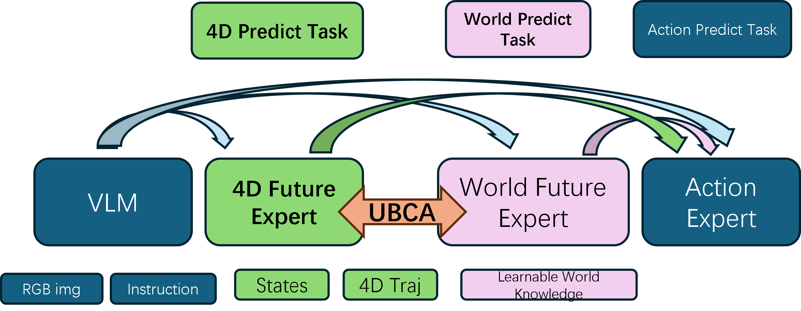
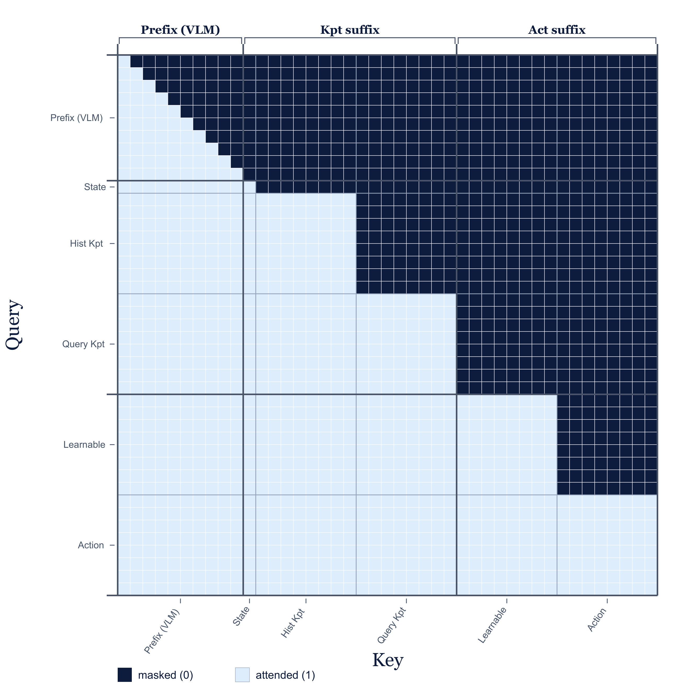

# 4DW-VLA: 4D and World-Model Aligned Vision-Language-Action for Robotic Manipulation

**Gang Luo**  
Daohe Tongtai

---

## Abstract

Most vision-language-action (VLA) policies operate on 2D images, yet robots act in a metric 3D workspace whose configuration evolves over time—a 4D problem. Methods that inject 3D or 4D structure often rely on depth sensors, point-cloud encoders, or heavy scene reconstruction, which increases model size, training cost, and deployment latency; many of them still treat spatial geometry and temporal dynamics as separate concerns. World-model-augmented VLAs predict future 2D video but rarely align that visual foresight with the robot's own metric body motion, so predicted actions can be temporally coherent in pixel space yet physically inconsistent in 3D. We present **4DW-VLA**, a **4D and world-model aligned VLA** that jointly models (i) the robot's future 4D body trajectories in 3D space and (ii) the future 2D video the onboard camera should observe, and uses both to condition chunked action generation. A lightweight **4D Future Expert** obtains 7D link trajectories (3D position + orientation) from forward kinematics (FK) at negligible cost—orders of magnitude cheaper than point-cloud or depth-pipeline 4D extraction. A compact **World Knowledge Expert** exchanges information with the 4D expert through **Unified Bidirectional Cross-Attention**, producing 2D-foresight tokens that are already aligned with predicted 4D motion and supervise a **frozen** large video world model during training only. At inference, the bulky world model is removed; the two lightweight experts and the action head remain, yielding a small deployable policy with no video-generation cost. We formulate multi-task learning over current 3D state estimation, future 4D prediction, future 2D foresight distillation, and action-chunk generation under a single weighted objective. On three RoboTwin 2.0 bimanual tasks, 4DW-VLA matches or exceeds representative baselines from the **2D-foresight** and **depth-plus-video** VLA families, with the largest gains under domain randomization.

---

## 1. Introduction

Learning-based manipulation policies and VLA models [rt1, rt2, chi2023diffusion, zhao2023act, kim2024openvla, black2024pi0] have improved language following and cross-task generalization, but they still under-represent the physical world in which a robot moves.

**Most VLAs are fundamentally 2D.** They consume RGB images and language, yet manipulation unfolds in a 3D workspace; when time is included, the relevant object is **4D** structure—how 3D geometry changes across the action horizon. A policy that reasons only in image space lacks explicit metric body motion and cannot guarantee that predicted actions respect the robot's own spatial evolution.

**3D-/4D-aware VLAs often pay a heavy geometric tax.** Point clouds, depth maps, voxel grids, and 3D Gaussian fields can improve spatial reasoning [ze2024dp3, yang2025fp3, gervet2023act3d], but they typically require extra sensors or large perception networks to extract and encode geometry at every timestep. The resulting models are bigger, slower to train, and harder to deploy. Moreover, many 3D-enhanced designs treat geometry as a **static** per-frame cue and under-model **temporal** changes in the robot's own configuration.

**Temporal prediction is usually misaligned across modalities.** Actions are inherently future-oriented: a policy outputs action chunks over horizon $H$. Yet most VLAs do not jointly predict how **2D observations** and **3D/4D body state** should co-evolve over that horizon. World-model and world-action-model (WAM) lines predict future video [ha2018worldmodels, nvidia2026wam, lawam2026], but often without explicit metric 4D body motion; the camera may "imagine" a future that is not consistent with the robot's actual 3D trajectory (e.g., the arm rises in joint space but the predicted video does not show the raised hand).

**These signals should be coupled.** When a robot lifts its end-effector in 3D, the egocentric camera stream should reflect that motion; conversely, visual foresight should not contradict feasible body dynamics. Effective manipulation therefore requires **aligning** (a) future **4D body motion** in the robot frame and (b) future **2D video** the camera will see, and using both to predict (c) future **actions**.

We propose **4DW-VLA**—**4D and World-model aligned VLA**—to address the above gaps. Our design rests on three ideas:

1. **Low-cost 4D from FK.** Instead of reconstructing scene geometry from depth or point clouds, we compute 7D link trajectories (3D position + orientation) directly from proprioception via FK. This is essentially free at control rates and avoids the orders-of-magnitude overhead of perception-based 4D pipelines.

2. **Unified Bidirectional Cross-Attention between 4D and 2D futures.** Two lightweight transformer experts—the **4D Future Expert** and the **World Knowledge Expert**—each maintain a temporal token sequence. At every timestep, a token attends causally within its own stream (self-attention on past tokens) and to past tokens of the **other** stream (cross-attention). This symmetric coupling lets 4D body foresight inform 2D visual foresight and vice versa before either reaches the action head.

3. **Train with a large frozen world model; deploy without it.** The World Knowledge Expert produces compact **implicit 2D-foresight tokens** already aligned with 4D predictions. During training, these tokens condition a **frozen** large video diffusion world model to predict future camera video; at inference the world model is **discarded**, so the deployable VLA stays small and fast while retaining distilled, 4D-aligned visual dynamics.

Fig. 1 summarizes the architecture. We co-train four objectives—current 3D state estimation, future 4D prediction, future 2D foresight distillation, and action-chunk generation—under one weighted multi-task loss (Section 3.5). The video world model $g_{\mathrm{wm}}$ stays **frozen** throughout; the VLM backbone is fine-tuned at **one-fifth** the learning rate of the expert and action heads over **10{,}000** optimizer steps.

**Contributions.**

1. We formulate **4D–2D–action alignment** for VLA manipulation: joint modeling of future metric body trajectories and future egocentric video, both conditioning chunked action prediction (Section 3.1).

2. We introduce a **4D Future Expert** that uses **FK-derived 7D link trajectories** as a lightweight 4D representation, avoiding costly point-cloud / depth-based 4D extraction while retaining temporal density and action alignment (Section 3.2).

3. We propose **Unified Bidirectional Cross-Attention** between the 4D Future Expert and a compact **World Knowledge Expert**, enabling mutually conditioned 4D and 2D future representations (Section 3.3).

4. We distill a **frozen** large video world model into trainable foresight tokens during training and **remove** the world model at inference, preserving 4D–2D alignment without deployment-time video generation (Section 3.3–3.4).

5. We describe a **multi-task training objective** with tunable weights over current-state, 4D-future, 2D-future, action, and optional VQA losses (Section 3.5).

---

## 2. Related Work

### 2.1 Foundation Models in Robotics

Generalist robot policies are trained on large multi-task datasets [walke2023bridge, khazatsky2024droid, vuong2023oxe] and increasingly built on vision-language priors [rt2, kim2024openvla, black2024pi0, liu2024rdt]. RT-2 [rt2] and OpenVLA [kim2024openvla] cast actions as language-model tokens; Diffusion Policy [chi2023diffusion], RDT [liu2024rdt], and $\pi_0$ [black2024pi0] generate continuous action chunks via diffusion or flow matching. These foundations excel at semantic generalization but largely treat observations as 2D images without explicit 4D body–video alignment.

World-action models (WAMs) co-train video prediction with control [nvidia2026wam, lawam2026, dreaming2026]: the predicted future regularizes the action pathway, and generation is often dropped at test time. **4DW-VLA** follows the "train with foresight, infer without the generator" principle, but differs in **what** is aligned: we explicitly couple **FK-derived 4D body trajectories** with **2D video foresight** through bidirectional cross-attention before action decoding, rather than relying on video prediction alone.

### 2.2 3D and 4D Representations for Manipulation

A growing line injects 3D or 4D structure into manipulation policies and VLAs. These methods improve spatial and temporal reasoning, but the **4D signals they use are typically heavy**: they require extra sensing, large encoders, auxiliary foundation models, or scene-scale reconstruction, which inflates compute, memory, and model size. **4DW-VLA** deliberately avoids this tax by deriving 4D body motion from FK and distilling 2D dynamics into a small expert rather than embedding a full world model in the deployable policy.

**RynnWorld-4D** (Alibaba DAMO Academy) [rynnworld4d2026] builds a tri-branch diffusion world model that co-generates future RGB, **depth**, and **optical flow** from RGB-D input, curates hundreds of millions of frames with pseudo depth/flow labels, and trains an inverse-dynamics policy on internal 4D latents. The approach is powerful but **infrastructure-heavy**: multi-branch diffusion, RGB-D sensing or estimation, and a large generative backbone dominate training and serving cost.

**4D-VLA** [fourdvla2025] injects sequential **RGB-D** frames with 3D coordinate embeddings into VLA pretraining to mitigate cross-scene coordinate chaos. It improves spatial generalization on multi-view benchmarks, but **depth must be available or estimated for every frame** in the temporal window, and the 3D-aware module adds non-trivial width to an already large VLM backbone.

**Pri4R** (LG AI Research et al.) [pri4r2026] supervises VLMs with **privileged scene point tracks**—4D geometry from depth-based tracking—during training. Scene point tracks are informative but **expensive to obtain and encode**: they require high-fidelity 3D tracking pipelines and a dedicated point-tracking head, and they model **scene** motion rather than lightweight **body-centric** 4D tied directly to proprioception.

**Lift3D-VLA** [lift3dvla2026] lifts VLAs with explicit **point clouds**, GC-MAE pretraining over reconstructed geometry, and layer-wise temporal action modeling. Point clouds are typically produced by VGGT-style reconstruction from RGB trajectories; the 3D encoder, masked autoencoding stage, and multi-plane projection add **substantial parameters and preprocessing** compared with FK on joint angles.

**SpatialVLA** [spatialvla2025] integrates **monocular depth estimation** (ZoeDepth) and egocentric 3D position encoding into a 4B-scale VLA pretrained on 1.1M robot episodes. Depth inference per frame and 3D position MLPs improve spatial robustness but introduce a **permanent depth branch** at inference unless distilled away.

**4D-WAM** [fourdwam2026] aligns world-action models with dense **pixel-level 3D trajectory fields** from a 4D foundation teacher (Trace Anything). The teacher itself is a large video-to-3D-track model; alignment improves WAM features but keeps **scene-scale 4D** in the training loop.

In contrast, **4DW-VLA** obtains 4D through **FK on proprioception**—microseconds on CPU, no depth network, no point cloud— and aligns it to 2D foresight through **two small coupled experts**, using a frozen world model only as a **training-time teacher**. The deployable model excludes the teacher entirely.

### 2.3 World Models and World-Action Models

Classical world models predict future states for planning or representation learning [ha2018worldmodels, levy2026simdist, hansen2024tdmpc2]. Recent WAMs make the future **action-facing** [nvidia2026wam, wamsurvey2026]: video or latent subgoals regularize the policy [lawam2026, dreaming2026]. **4DW-VLA** contributes a complementary axis: the training signal is not only "predict future pixels" but **align future pixels with future FK 4D body motion** via bidirectional cross-attention, then condition actions on both distilled pathways. The large video model is frozen and removed at deployment, similar in spirit to fast WAM recipes but with explicit **4D–2D coupling**.

---

## 3. Method

We present 4DW-VLA, a 4D and world-model aligned VLA for language-conditioned manipulation. A VLM encodes multi-view RGB and instructions; three trainable heads—a **4D Future Expert**, a **World Knowledge Expert**, and an **Action Expert**—cooperate through Unified Bidirectional Cross-Attention and feed a multi-task objective. Fig. 1 shows the overview.

<!-- -->

**Figure 1. 4DW-VLA overview.** A VLM prefix encodes RGB and language. The **4D Future Expert** predicts current and future FK 7D link trajectories from proprioception and 4D history. The **World Knowledge Expert** predicts implicit 2D-foresight tokens aligned with 4D through **Unified Bidirectional Cross-Attention**. A **frozen** video world model supervises 2D foresight during training only. The **Action Expert** consumes VLM tokens, both experts' outputs, and predicts action chunks. At inference, the world model is dropped; the VLM, two experts, and action head remain.

### 3.1 Problem Formulation

Let $o_t$ denote multi-view RGB, $\ell_t$ the language instruction, and $q_t$ proprioception (joint positions, gripper state, etc.). Write $p_t$ for the robot's **current metric 3D body state** (FK-derived link poses at time $t$), $P_{t+1:t+H}$ for the **future 4D body trajectory** over action horizon $H$, and $V_{t+1:t+T}$ for the **future egocentric video** over foresight horizon $T$.

We factorize manipulation into three coupled predictive problems:

**4D–2D future alignment.**

$$
p\bigl(P_{t+1:t+H},\, V_{t+1:t+T} \mid o_t,\, \ell_t,\, q_t\bigr).
\tag{1}
$$

The model must jointly explain how the robot will move in 3D/4D and what the camera will observe—a raised arm should correspond to visible arm motion in the predicted video stream.

**Action prediction conditioned on aligned futures.**

$$
p\bigl(A_t \mid P_{t+1:t+H},\, V_{t+1:t+T},\, o_t,\, \ell_t,\, q_t\bigr),
\quad A_t = [a_t, \ldots, a_{t+H-1}].
\tag{2}
$$

At deployment we approximate Eq. (2) with compact expert representations $Z^{\mathrm{4D}}_t$ and $Z^{\mathrm{wk}}_t$ (implicit 2D foresight) in place of explicit video generation:

$$
p\bigl(A_t \mid Z^{\mathrm{4D}}_t,\, Z^{\mathrm{wk}}_t,\, o_t,\, \ell_t,\, q_t\bigr).
\tag{3}
$$

**Current 3D state estimation** (auxiliary, stabilizes 4D prediction):

$$
p\bigl(p_t \mid o_t,\, \ell_t,\, P^{\mathrm{hist}}_t\bigr),
\tag{4}
$$

where $P^{\mathrm{hist}}_t$ is a short history of FK 4D tracks.

### 3.2 4D Future Expert

**Motivation.** Point-cloud, depth, and scene-track 4D representations require sensing or heavy networks (Section 2.2). Manipulators already expose $q_t$; FK maps joints to link poses in microseconds. We therefore build 4D body supervision from **FK only**, gaining orders-of-magnitude lower latency and zero extra sensors compared with perception-based 4D pipelines.

**7D link trajectories.** For each link/keypoint $k \in \{1,\ldots,K\}$,

$$
x^k_t = \mathrm{FK}_k(q_t) = \bigl[p^k_t,\, r^k_t\bigr] \in \mathbb{R}^7,
\tag{5}
$$

where $p^k_t \in \mathbb{R}^3$ is the link position and $r^k_t \in \mathbb{R}^4$ its orientation (unit quaternion) in the robot base frame. Stacking over links and time yields the 4D tensor $P^{\mathrm{hist}}_t$ and ground-truth futures $P_{t+1:t+H}$.

**Expert architecture.** The 4D Future Expert is a lightweight transformer over temporal 4D tokens derived from $q_t$ and $P^{\mathrm{hist}}_t$, plus conditioning from the VLM prefix (image + language). It outputs:

- reconstructed **current** 4D state $\hat{P}_t$;
- predicted **future** 4D trajectory $\hat{P}_{t+1:t+H}$;
- hidden tokens $Z^{\mathrm{4D}}_t$ consumed by the World Knowledge Expert and Action Expert.

**Role of $q_t$.** Proprioception enters both as raw input tokens and as the quantity that defines FK targets. Conditioning on $q_t$ anchors predictions in the robot's instantaneous configuration; through Unified Bidirectional Cross-Attention (Section 3.3), $Z^{\mathrm{4D}}_t$ also supplies metric body context to the 2D foresight pathway—when the arm moves in joint space, the World Knowledge Expert sees the corresponding 4D token evolution.

**4D future loss.**

$$
\mathcal{L}_{\mathrm{4D}} = \beta \Bigl(
    \operatorname{MSE}\bigl(\hat{P}_t(q_t),\, P_t\bigr)
    + \gamma\, \operatorname{MSE}\bigl(\hat{P}_{t+1:t+H}(q_t),\, P_{t+1:t+H}\bigr)
\Bigr),
\tag{6}
$$

where $\hat{P}(\cdot)$ emphasizes dependence on $q_t$ and VLM context, $\operatorname{MSE}$ averages over links, 7D components, and (for the future term) horizon $H$, and $\beta,\gamma$ balance current vs. future terms.

**Current 3D/4D state loss** (first multi-task head):

$$
\mathcal{L}_{\mathrm{cur}} = \operatorname{MSE}\bigl(\hat{p}_t,\, p_t\bigr),
\tag{7}
$$

with $\hat{p}_t$ the expert's estimate of the current aggregated body state from $(o_t, \ell_t, P^{\mathrm{hist}}_t)$.

### 3.3 World Knowledge Expert and 4D–2D Alignment

**Motivation.** Predicting future video alone does not guarantee consistency with body motion. We introduce a compact **World Knowledge Expert** that learns **implicit 2D-foresight tokens** $Z^{\mathrm{wk}}_t \in \mathbb{R}^{M \times d}$—a low-dimensional summary of what the camera should see—**aligned** with the 4D Future Expert's predictions.

**Unified Bidirectional Cross-Attention (UBCA).** The 4D and World Knowledge experts are two transformer modules, each carrying $T$ temporal tokens (one per foresight step; in practice $T$ aligns with video horizon). At layer $\ell$ and timestep $i$, let $h^{\mathrm{4D}}_{\ell,i}$ and $h^{\mathrm{wk}}_{\ell,i}$ denote hidden states.

Within a **causal** horizon (no looking ahead):

- **Intra-stream (self) attention:** each token attends to tokens at timesteps $\le i$ within its own module.
- **Inter-stream (cross) attention:** each token also attends to tokens at timesteps $\le i$ in the **other** module.

Formally, for module $A \in \{\mathrm{4D}, \mathrm{wk}\}$ with companion module $B$:

$$
\tilde{h}^A_{\ell,i} = \mathrm{Attn}\bigl(q(h^A_{\ell,i}),\; K^A_{\le i},\; V^A_{\le i}\bigr)
+ \mathrm{Attn}\bigl(q(h^A_{\ell,i}),\; K^B_{\le i},\; V^B_{\le i}\bigr),
\tag{8}
$$

where $K^X_{\le i}, V^X_{\le i}$ stack keys/values from module $X$ at timesteps $0..i$. The same update applies symmetrically to module $B$. Stacking layers yields coupled representations $Z^{\mathrm{4D}}_t$ and $Z^{\mathrm{wk}}_t$ that encode **bidirectionally aligned** 4D body futures and 2D visual futures.

This is implemented as a **shared causal attention** over concatenated 4D and world-knowledge token streams with a structured mask (Fig. 2): each timestep's 4D token sees past 4D and past world tokens; each world token sees past world and past 4D tokens—equivalent to dual-stream causal cross-attention in one kernel.

**Figure 2. Attention structure (conceptual).** Within the coupled 4D / World Knowledge block, tokens attend causally within their stream and to causal history in the partner stream. VLM prefix tokens attend only within the prefix; the Action Expert attends to the prefix and both expert streams.

**Implicit 2D foresight and frozen world model.** The world-knowledge pathway produces

$$
Z^{\mathrm{wk}}_t = f_{\mathrm{wk}}\bigl(o_t,\, \ell_t,\, q_t,\, Z^{\mathrm{4D}}_t\bigr),
\tag{9}
$$

already 4D-aligned via UBCA. During training, $Z^{\mathrm{wk}}_t$ is projected and fed as cross-attention context to a **frozen** large video diffusion transformer $g_{\mathrm{wm}}$ (e.g., a multi-billion-parameter video foundation model). Given ground-truth future frames $o_{t+1:t+T}$, VAE latents $x_0$, noise $\epsilon$, and timestep $\tau \sim \mathcal{U}[0,1]$ with $x_\tau = (1-\tau)x_0 + \tau\epsilon$:

$$
\mathcal{L}_{\mathrm{vid}} = \mathbb{E}_{\tau,\epsilon}\Bigl[
    \bigl\| g_{\mathrm{wm}}(x_\tau,\, h(Z^{\mathrm{wk}}_t)) - (\epsilon - x_0) \bigr\|^2
\Bigr].
\tag{10}
$$

Only $f_{\mathrm{wk}}$, UBCA parameters, and projection $h$ are updated; $g_{\mathrm{wm}}$ weights are **frozen**. Thus the **bulky world model is not part of the trainable VLA capacity**—it acts as a teacher that shapes $Z^{\mathrm{wk}}_t$.

**Inference.** $g_{\mathrm{wm}}$ is **not loaded**. Action generation uses $Z^{\mathrm{4D}}_t$ and $Z^{\mathrm{wk}}_t$, which already encode distilled, aligned future knowledge:

$$
\hat{A}_t = f_{\mathrm{act}}\bigl(o_t,\, \ell_t,\, q_t,\, Z^{\mathrm{4D}}_t,\, Z^{\mathrm{wk}}_t\bigr).
\tag{11}
$$

This keeps the deployable model **small and fast** while preserving training-time 4D–2D alignment.

### 3.4 Action Expert

The **Action Expert** is a flow-matching (or diffusion) head that generates action chunk $A_t$ conditioned on the VLM prefix, $Z^{\mathrm{4D}}_t$, $Z^{\mathrm{wk}}_t$, and proprioceptive tokens. Let $A^0_t$ denote the ground-truth action chunk, $\epsilon \sim \mathcal{N}(0,I)$, and $\tau \sim \mathcal{U}[0,1]$ with noisy actions $A^\tau_t = (1-\tau)A^0_t + \tau\epsilon$. The expert predicts denoising velocity $v_\theta$:

$$
\mathcal{L}_{\mathrm{act}} = \mathbb{E}_{\tau,\epsilon}\Bigl[
    \bigl\| v_\theta(A^\tau_t,\, o_t,\, \ell_t,\, q_t,\, Z^{\mathrm{4D}}_t,\, Z^{\mathrm{wk}}_t) - (\epsilon - A^0_t) \bigr\|^2
\Bigr].
\tag{12}
$$

Actions are thus explicitly conditioned on **aligned 4D and 2D future representations**, not on raw images alone.

### 3.5 Multi-Task Training Objective

**Input modalities:** RGB ($o_t$), language ($\ell_t$), proprioception ($q_t$), and FK-derived 4D history $P^{\mathrm{hist}}_t$.

**Tasks.**

| Task | Heads involved | Loss |
|------|----------------|------|
| Current 3D/4D state from vision, language, 4D history | 4D Future Expert | $\mathcal{L}_{\mathrm{cur}}$ (Eq. 7) |
| Future 4D trajectory (uses $Z^{\mathrm{wk}}$ via UBCA) | 4D Future Expert + World Knowledge Expert | $\mathcal{L}_{\mathrm{4D}}$ (Eq. 6) |
| Future 2D video foresight (uses $Z^{\mathrm{4D}}$ via UBCA) | World Knowledge Expert + frozen $g_{\mathrm{wm}}$ | $\mathcal{L}_{\mathrm{vid}}$ (Eq. 10) |
| Action chunk | Action Expert | $\mathcal{L}_{\mathrm{act}}$ (Eq. 12) |
| Optional VQA / instruction grounding | VLM (low LR) | $\mathcal{L}_{\mathrm{vqa}}$ |

**Total loss.**

$$
\mathcal{L} = \lambda_{\mathrm{cur}}\mathcal{L}_{\mathrm{cur}}
    + \lambda_{\mathrm{4D}}\mathcal{L}_{\mathrm{4D}}
    + \lambda_{\mathrm{vid}}\mathcal{L}_{\mathrm{vid}}
    + \lambda_{\mathrm{act}}\mathcal{L}_{\mathrm{act}}
    + \lambda_{\mathrm{vqa}}\mathcal{L}_{\mathrm{vqa}}.
\tag{13}
$$

Coefficients $\lambda_{\cdot}$ are fixed hyperparameters tuned on validation trajectories. $\mathcal{L}_{\mathrm{4D}}$ already contains internal weights $\beta$ and $\gamma$ (Eq. 6).

**Training schedule.** Post-training runs for **10{,}000** optimizer steps. The video world model $g_{\mathrm{wm}}$ is **frozen** and used only as a teacher for $\mathcal{L}_{\mathrm{vid}}$. All other trainable modules—the VLM backbone, 4D Future Expert, World Knowledge Expert, UBCA coupling, projection $h$, and Action Expert—are updated jointly from step~0. Let $\eta$ denote the base learning rate for the experts and action head; the VLM uses learning rate $\eta/5$.

### 3.6 Inference

At deployment:

1. Encode $(o_t, \ell_t)$ with the VLM.
2. Run the **4D Future Expert** on $(q_t, P^{\mathrm{hist}}_t)$ and the **World Knowledge Expert** with UBCA to obtain $Z^{\mathrm{4D}}_t$, $Z^{\mathrm{wk}}_t$.
3. Run the **Action Expert** once (flow-matching sampling or single-step if configured) to output $A_t$.
4. **Do not** invoke $g_{\mathrm{wm}}$; no video latents are generated.

The extra cost vs. a plain 2D VLA is two lightweight expert forward passes and FK on $q_t$—negligible compared with depth networks, point-cloud backbones, or iterative video diffusion.

---

## 4. Experiments

We evaluate 4DW-VLA on RoboTwin 2.0 [chen2025robotwin2] against two **representative baseline families** that isolate different gaps in current VLA design. We ask:

1. Does explicit **4D–2D alignment** improve in-domain (Easy) success over a **2D-foresight** VLA that predicts future video but not metric 3D/4D body motion?
2. Does the same recipe improve robustness on the Hard (domain-randomized, OOD) split relative to both baseline families?
3. Do gains persist across stacking, tool-use scanning, and placement tasks?

### 4.1 Experimental Setup

**Benchmark.** RoboTwin 2.0 is a dual-arm manipulation suite on SAPIEN with domain randomization over clutter, lighting, background texture, table height, and language [chen2025robotwin2]. We follow the public Easy / Hard protocol: Easy = `demo_clean`; Hard = `demo_randomized` (OOD). Evaluations use the Aloha-AgileX bimanual embodiment. Success rate is the metric.

**Tasks.**

- `stack_bowls_three`: stack three bowls — geometrically precise and contact-rich.
- `scan_object`: dual-arm tool use — one arm holds a scanner, the other an object, then scans.
- `place_bread_skillet`: place bread in a skillet — a distinct placement objective.

**Baselines.** We compare against two published VLAs that represent complementary design points; neither serves as an architectural parent of 4DW-VLA.

- **InternVLA-A1.5** [internvla15] (Shanghai AI Laboratory) represents the **2D-foresight VLA** family: it incorporates **temporal reasoning** and distills **future 2D video** into the action pathway, but does **not** explicitly model **3D/4D metric body motion** or align body dynamics with visual foresight. We re-implement and train it in our codebase under the same post-training budget as 4DW-VLA for a controlled comparison.

- **LingBot-VLA 2.0** [lingbot2026] (Robbyant / Ant Group) represents the **depth-plus-video VLA** family: it scales cross-embodiment training with **3D (depth) cues** and **temporal video generation**, but does **not** couple **3D/4D body trajectories** with **2D temporal evolution** through an explicit alignment mechanism. **We do not reproduce LingBot-VLA 2.0** (no checkpoint, training code, or verified matching schedule); its numbers are **as-reported** from the public release and should be read as an external reference, not a controlled comparison. LingBot-VLA 2.0 was not evaluated on `scan_object` or `place_bread_skillet` (n/a).

**Training recipe (4DW-VLA and re-implemented InternVLA-A1.5).** Both methods share a **10{,}000-step** post-training budget on RoboTwin 2.0. The video world model $g_{\mathrm{wm}}$ is **frozen** during training. Expert and action-head parameters use base learning rate $\eta$; the VLM backbone uses $\eta/5$. No separate warmup stage is applied.

**Table 1. Post-training success rates (%) on RoboTwin 2.0.** Easy = `demo_clean`; Hard = `demo_randomized` (OOD). Bold = best per column. LingBot-VLA 2.0: n/a on two tasks.

| Method | stack_bowls_three Easy | stack_bowls_three Hard | scan_object Easy | scan_object Hard | place_bread_skillet Easy | place_bread_skillet Hard |
|--------|------------------------|------------------------|------------------|------------------|--------------------------|--------------------------|
| InternVLA-A1.5 | 71 | 56 | **45** | 28 | 31 | 20 |
| LingBot-VLA 2.0 | 78 | 22 | n/a | n/a | n/a | n/a |
| **4DW-VLA (ours)** | **81** | **58** | **45** | **33** | **39** | **29** |

**Table 2. Shared post-training recipe (4DW-VLA and re-implemented InternVLA-A1.5).**

| Item | Setting |
|------|---------|
| Benchmark | RoboTwin 2.0 |
| Post-training budget | 10{,}000 steps |
| Video world model $g_{\mathrm{wm}}$ | Frozen |
| VLM learning rate | $\eta/5$ (experts / action head at $\eta$) |
| Warmup | None |
| Easy / Hard | `demo_clean` / `demo_randomized` |

### 4.2 Main Results

Fig. 3 visualizes Table 1.

**Figure 3. RoboTwin 2.0 success rates.** Grouped bars for Easy and Hard on three tasks. LingBot-VLA 2.0 is not evaluated on `scan_object` or `place_bread_skillet` (n/a). InternVLA-A1.5 and 4DW-VLA share the 10{,}000-step recipe in Table 2.

**`stack_bowls_three`.** 4DW-VLA reaches 81% Easy and 58% Hard, vs. InternVLA-A1.5 (71% / 56%) and LingBot-VLA 2.0 (78% / 22%). On Easy all three are competitive; on Hard, LingBot-VLA 2.0 collapses to 22% while 4DW-VLA holds 58%. This pattern is consistent with **4D–2D aligned body foresight** helping under visual randomization—metric FK 4D coupled to distilled 2D dynamics—rather than depth or video alone.

**`scan_object`.** 4DW-VLA ties InternVLA-A1.5 on Easy (45%) and leads on Hard (33% vs. 28%). The modest Hard gain suggests aligned 4D trajectories stabilize dual-arm tool use when appearance varies.

**`place_bread_skillet`.** 4DW-VLA reaches 39% Easy and 29% Hard vs. 31% and 20% for InternVLA-A1.5 (+8 / +9 points). LingBot-VLA 2.0 has no reported result on this task.

Across evaluated columns, 4DW-VLA is best reported. Relative to the **2D-foresight** baseline (InternVLA-A1.5), Hard gains are +2, +5, and +9 points on the three tasks. Relative to **LingBot-VLA 2.0**, the Hard gain on `stack_bowls_three` is +36 points. Trial counts and confidence intervals are not yet finalized (Section 5).

### 4.3 What the Numbers Do and Do Not Show

Easy scores match or exceed InternVLA-A1.5 on all three tasks, indicating that 4D and aligned 2D auxiliary heads need not hurt in-domain learning. Consistent Hard improvements over InternVLA-A1.5 support the hypothesis that **explicit 4D–2D coupling** matters more under domain shift than **2D video foresight alone**.

The comparison does **not** yet isolate UBCA from the multi-task loss, nor separate 4D prediction from video distillation. LingBot-VLA 2.0 numbers are unverified externally reported values. Results should be read as evidence for the design hypothesis, not as a full ablation.

### 4.4 Real-Robot Validation (In Progress)

**Table 3. Real-robot validation protocol (results pending).**

| Item | Setting |
|------|---------|
| Platform | TBD |
| Tasks | TBD subset of the three RoboTwin 2.0 tasks above |
| Trials per task | TBD |
| Compared methods | 4DW-VLA vs. InternVLA-A1.5 (2D-foresight baseline) |
| Metric | Success rate |

---

## 5. Limitations

- **Body-centric 4D, not full scene geometry.** FK trajectories capture the robot's own motion, not independent object dynamics or extrinsic scene structure.

- **FK accuracy depends on calibration.** URDF–hardware mismatch propagates into 4D labels; sim-to-real kinematics gap is unstudied.

- **World-model distillation quality.** Removing $g_{\mathrm{wm}}$ at inference assumes $Z^{\mathrm{wk}}_t$ captures sufficient visual dynamics.

- **UBCA ablations pending.** Late concatenation and unidirectional cross-attention are not yet compared.

- **Incomplete ablations.** Contributions of $\mathcal{L}_{\mathrm{4D}}$, $\mathcal{L}_{\mathrm{vid}}$, and UBCA are not isolated; $\lambda_{\cdot}$, $\beta$, $\gamma$, and horizons $H$, $T$ are not fully swept.

- **Limited task set and metadata.** Three RoboTwin 2.0 tasks only; trial counts, seeds, and confidence intervals remain to be finalized.

- **Real-robot validation incomplete.** All Table 1 numbers are simulated; Section 4.4 results are pending.

---

## 6. Conclusion

We presented **4DW-VLA**, a **4D and world-model aligned VLA** for robotic manipulation. It addresses the gap between 2D image policies and the 4D physical world by (i) **lightweight FK 7D link trajectories** instead of costly perception-based 4D, (ii) **Unified Bidirectional Cross-Attention** that aligns future 4D body motion with future 2D camera video, and (iii) **distilling** a frozen large video world model at training time while **discarding** it at inference. On RoboTwin 2.0, 4DW-VLA matches or exceeds a **2D-foresight** representative (InternVLA-A1.5) and a **depth-plus-video** representative (LingBot-VLA 2.0, as-reported), with the strongest advantage under domain randomization—consistent with the claim that coupling metric body motion to visual foresight matters beyond temporal 2D prediction or depth-augmented video alone. Future work will ablate UBCA and multi-task components, extend evaluation, and complete real-robot validation (Section 4.4).

---

## References

Key citations used in this draft (see `references.bib` for BibTeX):

| Key | Work |
|-----|------|
| rynnworld4d2026 | RynnWorld-4D (Alibaba DAMO Academy) |
| fourdvla2025 | 4D-VLA (NeurIPS 2025) |
| pri4r2026 | Pri4R (LG AI Research et al.) |
| lift3dvla2026 | Lift3D-VLA |
| spatialvla2025 | SpatialVLA |
| fourdwam2026 | 4D-WAM |
| rt1, rt2, kim2024openvla, black2024pi0 | Foundational VLAs / policies |
| chi2023diffusion, liu2024rdt | Diffusion / flow policies |
| ze2024dp3, yang2025fp3, gervet2023act3d | 3D manipulation policies |
| ha2018worldmodels, nvidia2026wam, lawam2026, dreaming2026, wamsurvey2026 | World / world-action models |
| walke2023bridge, khazatsky2024droid, vuong2023oxe | Robot datasets |
| internvla15, lingbot2026, chen2025robotwin2 | Baselines and benchmark |
